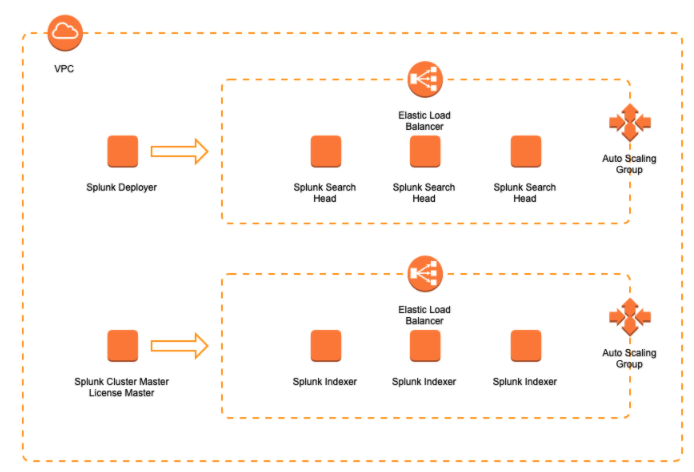

# Terraform AWS Splunk Enterprise
  
### About
This is a `WIP` or `draft` repo to stand up a clustered Splunk Enterprise on AWS.  
  
Note: The `user data` scripts to perfomr the clustered installs and configuration for the Search Heads and Indexers is not complete / working.
  
### Architecture
High level architecture of the Splunk Enterprise on AWS deployment.

  
### Terraform Versions
The following terraform versions have been tested:  
-0.13.7  
-0.14.11  
-0.15.3  
  
### To Do

